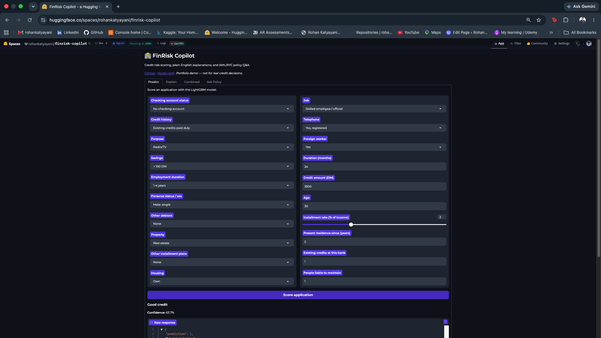
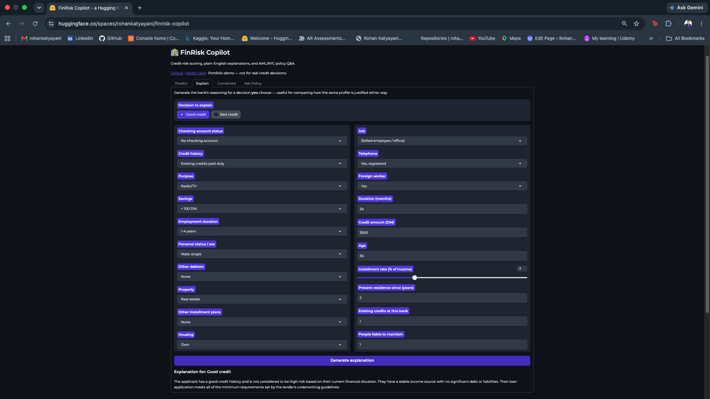
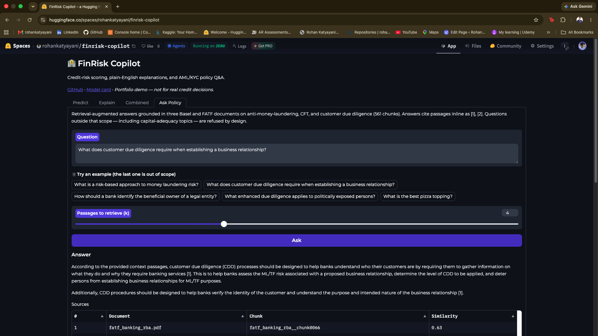
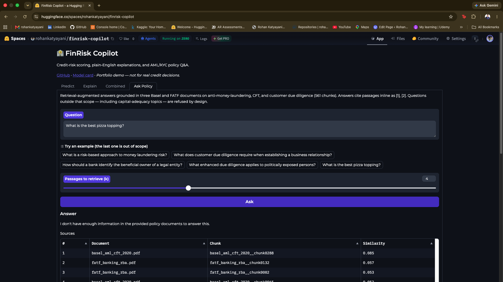

# FinRisk Copilot

A production-style banking AI system that combines tabular ML, a LoRA-fine-tuned LLM, and retrieval-augmented generation behind a single FastAPI service — tracked with MLflow, monitored with Evidently, containerized, and wired with CI.

[](https://www.python.org/)
[](https://fastapi.tiangolo.com/)
[](https://mlflow.org/)
[](https://github.com/RohanKatyayani/finrisk-copilot/actions/workflows/ci.yml)
[](LICENSE)
[](https://huggingface.co/spaces/rohankatyayani/finrisk-copilot)

---

## What it does

FinRisk Copilot scores credit-risk applications, explains its decisions in plain English, and answers AML/KYC policy questions from source documents. Three complementary components sit behind one API:

- **Risk Scorer** — A LightGBM classifier trained on the Statlog German Credit dataset, served from the MLflow Model Registry. Class weighting is tuned toward the minority (defaulting) class, because the dataset's own cost matrix prices a missed defaulter at 5× a wrongly rejected applicant.
- **LLM Explainer** — TinyLlama-1.1B fine-tuned with LoRA on synthetic bank-tone explanations, producing regulator-style prose for each decision. Published on the [Hugging Face Hub](https://huggingface.co/rohankatyayani/tinyllama-credit-explainer).
- **Policy Assistant (RAG)** — Grounded answers over three public Basel and FATF documents on anti-money-laundering, counter-terrorist financing, and customer due diligence (561 chunks). Text is embedded with `sentence-transformers` (all-MiniLM-L6-v2) into a FAISS index; generation runs on Groq (Llama 3.1 8B). Answers carry inline citations and similarity scores, and questions outside the corpus are refused rather than answered from the model's own knowledge.

All three are served behind one FastAPI app, with two four-tab UIs: Streamlit for local use, and Gradio for the hosted demo.

---

## Live demo

**▶ [Try it live on Hugging Face Spaces](https://huggingface.co/spaces/rohankatyayani/finrisk-copilot)** — four tabs, no setup required.

*The Space sleeps after ~48h idle and takes ~30s to wake.*

### Credit scoring


### LLM-generated explanation


### Grounded policy Q&A with citations


### Refusing an out-of-scope question
The same interface asked something outside the corpus. Retrieval similarity collapses from **0.63** to **0.085**, and the assistant declines rather than answering from the model's own knowledge.



---

## Model performance

Held-out test set of 200 applications (140 good, 60 bad).

| Metric | Value |
|---|---|
| ROC-AUC | **0.768** |
| Accuracy | 0.715 |
| Recall — bad credit | **0.683** (41 of 60 caught) |
| Precision — bad credit | 0.519 |
| F1 — bad credit | 0.590 |
| Recall — good credit | 0.729 |
| F1 — good credit | 0.782 |

Accuracy is deliberately **not** the headline metric: approving every applicant scores 0.700 on this class distribution. Scored on the dataset's official 5:1 cost matrix, tuning the class weight toward the minority class cut expected cost from 236 to **133** — a 44% reduction — while accuracy *fell* by 2.5 points. That trade is the correct one for credit risk.

Predicted probabilities are **not calibrated**; they are useful for ranking applicants, not as literal default likelihoods.

Full details, limitations, and fairness considerations: **[Model Card](docs/MODEL_CARD.md)** · **[Data Card](docs/DATA_CARD.md)**

---

## Quickstart

Requires Python 3.11. The first explanation request downloads model weights from the Hugging Face Hub and caches them locally.

```bash
# 1. Clone and set up
git clone https://github.com/RohanKatyayani/finrisk-copilot.git
cd finrisk-copilot
python3.11 -m venv .venv
source .venv/bin/activate
pip install --upgrade pip
pip install -r requirements.txt

# 2. Configure the Groq API key (needed for /ask_policy)
echo "GROQ_API_KEY=your_key_here" > .env

# 3. Train the LightGBM model (logs to MLflow, registers a version, saves a local .pkl)
python src/training/train_model.py
```

Then pick a UI.

**Option A — FastAPI service + Streamlit UI** (two processes; exercises the full API surface):

```bash
uvicorn src.service.app:app --port 8000    # terminal 1
streamlit run streamlit_app.py             # terminal 2
```

**Option B — Gradio UI only** (single process; the same app that runs on Spaces, calling the project's Python functions directly rather than over HTTP):

```bash
python app_gradio.py
```

The FAISS index for the policy assistant is committed to the repository, so no ingestion step is required. To rebuild it from the source PDFs, run `python -m src.rag.ingest`.

### API endpoints

| Endpoint | Method | Purpose |
|---|---|---|
| `/health` | GET | Liveness check, reports whether the model is loaded |
| `/predict` | POST | Credit-risk score from LightGBM |
| `/explain` | POST | Plain-English explanation from fine-tuned TinyLlama |
| `/predict_and_explain` | POST | Score + explanation in one call |
| `/ask_policy` | POST | Grounded answer over AML/KYC policy documents, with citations |

**Try `/predict_and_explain`:**

```bash
curl -X POST http://localhost:8000/predict_and_explain \
  -H "Content-Type: application/json" \
  -d '{
    "status":"A11","duration":24,"credit_history":"A34","purpose":"A43",
    "amount":3500,"savings":"A61","employment_duration":"A73",
    "installment_rate":2,"personal_status_sex":"A93","other_debtors":"A101",
    "present_residence":2,"property":"A121","age":30,
    "other_installment_plans":"A143","housing":"A152","number_credits":1,
    "job":"A173","people_liable":1,"telephone":"A192","foreign_worker":"A201"
  }'
```

Sample response — note that **`1` = good credit, `0` = bad credit**, and `probabilities` is indexed `[P(bad), P(good)]`:

```json
{
  "prediction": 1,
  "probabilities": [0.163, 0.837],
  "explanation": "The applicant has a good credit history and is not considered high-risk based on their current financial situation ..."
}
```

**Try `/ask_policy`:**

```bash
curl -X POST http://localhost:8000/ask_policy \
  -H "Content-Type: application/json" \
  -d '{"question": "What does customer due diligence require when establishing a business relationship?", "k": 4}'
```

The corpus covers AML, CFT, and KYC/CDD only. Questions outside that scope — including capital-adequacy topics such as Tier 1 capital or liquidity ratios — are refused by design.

---

## Architecture

```
   ┌───────────────────────┐          ┌───────────────────────┐
   │   Streamlit UI        │          │   Gradio UI           │
   │   (local, 4 tabs)     │          │   (Spaces, 4 tabs)    │
   └───────────────────────┘          └───────────────────────┘
               │ HTTP                              │ direct calls
               ▼                                   │
┌─────────────────────────────────────────────┐    │
│              FastAPI Service                │    │
│                                             │    │
│  POST /predict              → LightGBM      │    │
│  POST /explain              → TinyLlama     │    │
│  POST /predict_and_explain  → Both          │    │
│  POST /ask_policy           → RAG           │    │
└─────────────────────────────────────────────┘    │
         │            │             │              │
         ▼            ▼             ▼              │
  ┌──────────┐ ┌─────────────┐ ┌───────────────┐   │
  │ LightGBM │ │  TinyLlama  │ │ FAISS + MiniLM│◀──┘
  │ pipeline │ │   + LoRA    │ │  + Groq LLM   │
  └──────────┘ └─────────────┘ └───────────────┘
         │            │             │
         ▼            ▼             ▼
   ┌────────────────────────────────────────────────┐
   │     MLflow tracking + registry  ·  Evidently   │
   └────────────────────────────────────────────────┘
```

A note on serving the LLM locally: PyTorch deadlocks when loaded inside a forked uvicorn worker on macOS. `src/models/lora_infer.py` works around this by running each inference in a fresh Python subprocess. The hosted Gradio app runs a single process on Linux, so it loads the model in-process instead and wraps generation in a ZeroGPU-allocated call.

---

## MLOps

This project is built to show end-to-end operational ownership, not just modeling:

- **Experiment tracking** — every training run is logged to MLflow (params, metrics, artifacts).
- **Model Registry** — the LightGBM model is versioned through a `None → Staging → Production` lifecycle in an MLflow registry (SQLite backend). A promotion CLI (`scripts/promote_model.py`) moves versions between stages and auto-archives the previous occupant; the API loads the current Production model with a pickle fallback.
- **Drift monitoring** — Evidently runs Kolmogorov–Smirnov (numeric) and chi-square (categorical) tests to compare live inputs against the training distribution.
- **Containerization** — a production Dockerfile (non-root user, pinned system libs, healthcheck) runs the full service; verified end-to-end inside the container.
- **CI** — GitHub Actions runs a single pipeline on every push: lint (ruff) → format check (black) → train the model → pytest → Docker build.
- **Pre-commit hooks** — ruff and black run at commit time, pinned to the same versions CI uses, so formatting and lint failures cannot reach the remote.
- **Reproducible builds** — all Python dependencies are pinned to exact versions, so local and CI environments resolve identically.

---

## Deployment

Two container images, for two different jobs:

| Image | Purpose |
|---|---|
| `docker/Dockerfile` | API-only production image. Non-root user, healthcheck, serves FastAPI on 8000. Built and verified in CI. |
| `Dockerfile` (root) | Self-contained demo image. Trains the model at build time, then runs FastAPI on 8000 and Streamlit on 7860 via `start.sh`. |

The public demo runs on **Hugging Face Spaces (Gradio SDK, ZeroGPU)**. Two constraints shaped that build and are worth noting:

- ZeroGPU hardware pins **Python 3.10**, so the Space uses its own relaxed requirements file rather than this repo's 3.11 pins. The Space trains the model at startup instead of loading a pickle, which removes any serialization-compatibility risk from the version difference.
- On ZeroGPU, **any CUDA operation outside a `@spaces.GPU`-decorated function fails**. The sentence-transformers embedder is therefore pinned to CPU, and only LLM generation runs on GPU.

---

## Tech stack

- **ML:** scikit-learn, LightGBM, imbalanced-learn, SHAP *(exploratory analysis in notebooks; not used in the served explanations — see Responsible use)*
- **LLM:** Hugging Face Transformers, PEFT (LoRA), TinyLlama-1.1B
- **RAG:** sentence-transformers, FAISS, Groq (Llama 3.1 8B)
- **Serving:** FastAPI, uvicorn, pydantic, Streamlit, Gradio
- **MLOps:** MLflow (tracking + registry), Evidently (monitoring), Docker, GitHub Actions, pre-commit

---

## Project structure

```
finrisk-copilot/
├── streamlit_app.py              # Four-tab UI (HTTP client for the API)
├── app_gradio.py                 # Gradio UI deployed to Hugging Face Spaces
├── src/
│   ├── service/app.py            # FastAPI app + endpoints
│   ├── models/lora_infer.py      # Subprocess-isolated LLM inference
│   ├── training/
│   │   ├── train_model.py        # LightGBM training + MLflow logging
│   │   └── make_explanations.py  # Synthetic explanation dataset generator
│   └── rag/                      # RAG pipeline: ingest, embed, retrieve, answer
├── notebooks/                    # Preprocessing, feature engineering, LoRA fine-tuning
├── data/                         # German Credit CSV + committed FAISS index
├── docs/                         # Model card, data card, screenshots
├── tests/                        # pytest suite
├── scripts/promote_model.py      # MLflow Registry stage-promotion CLI
├── docker/Dockerfile             # API-only production image
├── Dockerfile                    # Demo image (API + UI in one container)
├── start.sh                      # Launches both processes for the demo image
├── .github/workflows/ci.yml      # CI pipeline
├── .pre-commit-config.yaml       # ruff + black hooks
└── requirements.txt              # Pinned dependencies
```

---

## Responsible use

This is a portfolio and educational project. It is **not** suitable for real credit decisions.

Two limitations are worth stating up front, and both are documented in full in the cards:

- **Explanations are not attributions.** The explainer is conditioned on the applicant's features and the decision, not on the classifier's internals or SHAP values. Its output is a plausible narrative consistent with the decision, not a faithful account of the model's reasoning — and must not be used as an adverse-action notice.
- **The dataset contains protected attributes.** `personal_status_sex`, `age`, and `foreign_worker` are used as features, faithful to the benchmark but unacceptable in real lending. No fairness audit has been performed.

---

## Status

- [x] Risk-scoring pipeline (LightGBM + MLflow)
- [x] Synthetic explanation dataset generation
- [x] LoRA fine-tuning of TinyLlama (Colab + Hugging Face Hub)
- [x] LLM-backed explanation endpoint
- [x] RAG over AML/KYC policy documents with citations
- [x] MLflow Model Registry + promotion CLI
- [x] Evidently drift monitoring
- [x] Dockerized deployment + GitHub Actions CI
- [x] Pinned dependencies and pre-commit hooks
- [x] Streamlit and Gradio UIs (four tabs each)
- [x] Model and data cards
- [x] Hosted public demo (Hugging Face Spaces, ZeroGPU)

### Known future work

- Condition the explainer on SHAP attributions so explanations reflect the model's actual reasoning
- Calibrate predicted probabilities
- Compute group-wise fairness metrics and audit proxy leakage
- Migrate the Model Registry from deprecated stages to aliases
- Add reranking to the RAG retrieval step

---

## Links

- **Live demo:** [Hugging Face Spaces](https://huggingface.co/spaces/rohankatyayani/finrisk-copilot)
- **Model card:** [`docs/MODEL_CARD.md`](docs/MODEL_CARD.md)
- **Data card:** [`docs/DATA_CARD.md`](docs/DATA_CARD.md)
- **Fine-tuned model:** [rohankatyayani/tinyllama-credit-explainer](https://huggingface.co/rohankatyayani/tinyllama-credit-explainer)
- **Training notebook:** [`notebooks/llama_finetune.ipynb`](notebooks/llama_finetune.ipynb)

---

## License

MIT © Rohan Katyayani